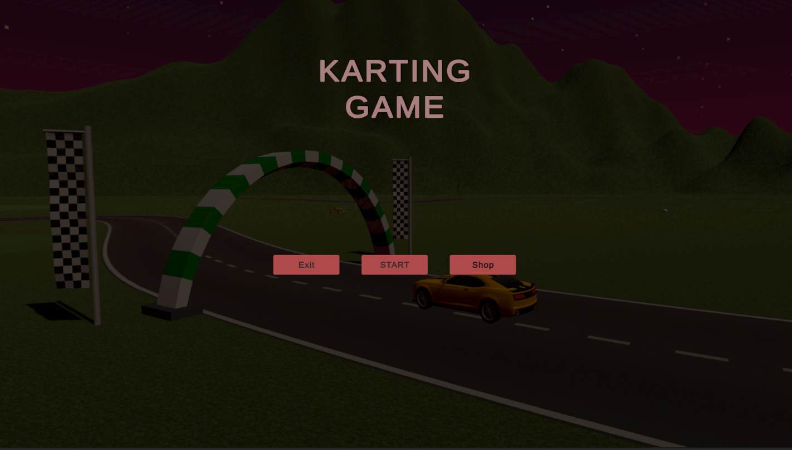
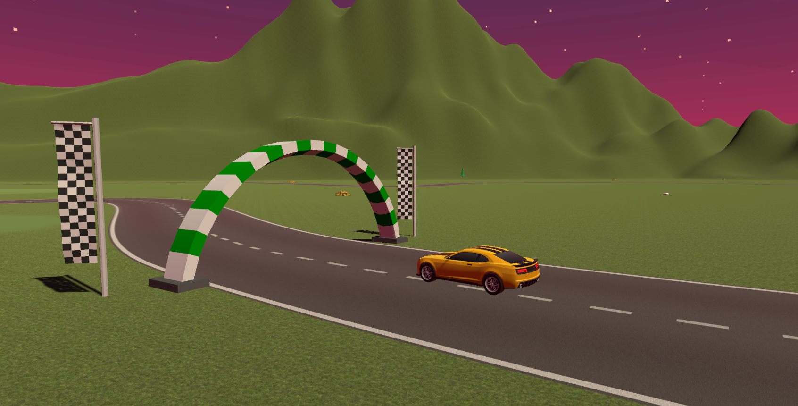
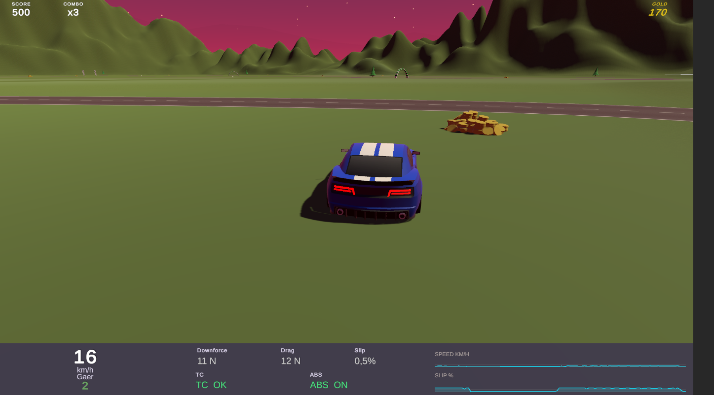
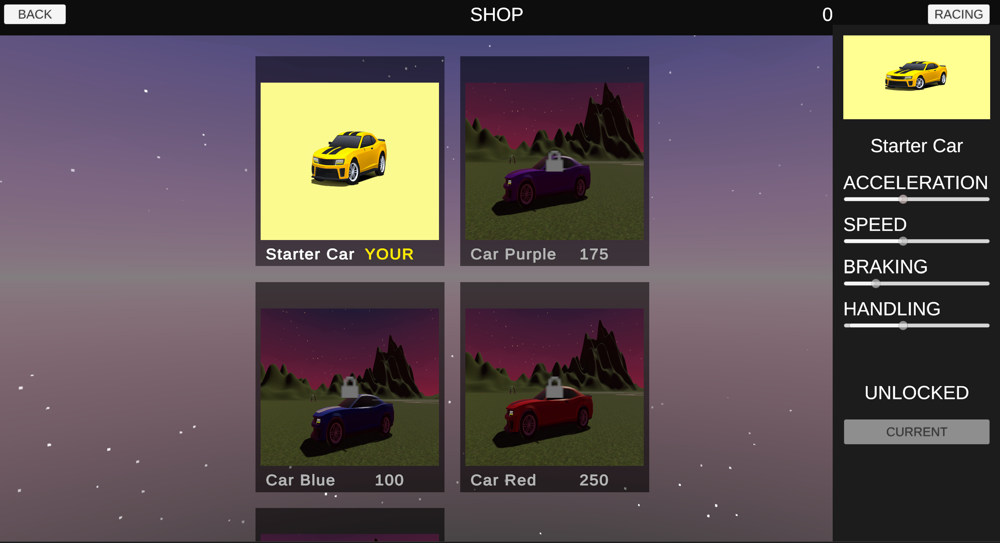

# 🏎️ Karting Game

> A  3D arcade racing game built in Unity 2023. Collect gold coins, maintain your combo multiplier, unlock new cars in the shop, and race across a detailed low-poly track — all powered by realistic vehicle physics.

---

## 📸 Screenshots

| Main Menu | Racing |
|-----------|--------|
|  |  |

| In-Game HUD & Telemetry | Car Shop |
|-------------------------|----------|
|  |  |

---

## ✨ Features

### 🎮 Core Gameplay
- **Arcade racing** on a winding low-poly road track
- Drive over coins to earn gold; coins animate with rotation and bobbing
- Hit checkpoints to earn score points scaled by your combo multiplier
- Lleaving the road resets your combo; surface physics change on grass vs asphalt

### 🪙  Scoring & Progression
- (x1 → x2 → x3 → x4) that builds during clean on-road driving
- Ccoins collected during an active combo are worth more
- Saved across sessions via `PlayerPrefs`
- tracking with new-record detection on the end screen

### 🏎️ Car Shop
-  Multipule cars with individual stats (Speed, Acceleration, Handling, Braking)
-  Spend earned gold to unlock new vehicles
-  The car you pick in the shop is the one you race with
-  Compare cars stats before buying

### 🪨 Vehicle Physics (WheelCollider-based)
- Realistic suspension (spring rate, damping, anti-roll bar)
- Traction Control (TC) with PI regulator — prevents wheel spin
- ABS with PI regulator — prevents wheel lock-up under braking
- Aerodynamic downforce & drag computed from real wing geometry (lifting-surface model)
- Surface-dependent friction  grip drops significantly on grass/dirt
- Air resistance scales quadratically with speed

### 📊 Telemetry HUD
- Real-time **speed, gear, downforce, drag, slip ratio**
- **TC / ABS** status indicators with colour coding
- Two live **line graphs** (speed history & slip ratio) using a custom `MaskableGraphic` renderer 

### 🖼️ Scenes
| Scene | Description |
|-------|-------------|
| `MainMenu` | Title screen with Start, Shop, and Exit buttons |
| `MainScene` | Main race scene with full physics and HUD |
| `CarShop` | Car selection and purchase screen |

### ⌨️ Quality of Life
- **R** key — instant race restart at any time
- Camera smoothing with `SmoothDamp` (frame-rate independent)
- Rigidbody interpolation for stutter-free rendering

---

## How to Play?

### ▶️ Play the pre-built Windows executable (recommended)

1. Go to the **[Releases](../../releases)** tab of this repository.
2. Download the latest `KartingGame_Windows.zip`.
3. Unzip and run **`KartingGame.exe`** — no installation required.

### 🛠️ Run from source in Unity

| Requirement | Version |
|-------------|---------|
| Unity Editor | 2023.1 LTS or newer |
| Render Pipeline | Built-in |
| Platform | Windows / Mac / Linux |

```
1. Clone this repository
2. Open the project in Unity Hub
3. Open Assets/Scenes/MainMenu.unity
4. Press Play — or build via File → Build Settings
```

> **Asset Store packages required** (free):
> `FREE Casual Game SFX Pack` · `Gold Coins` · `FREE Skybox Extended Shader` · `EasyRoads3D Free v3` · `ARCADE: FREE Racing Car` · `Environment Track Lowpoly: Cartoon`

---

## 🎮 Controls

| Input | Action |
|-------|--------|
| `W` / `↑` | Accelerate |
| `S` / `↓` | Brake / Reverse |
| `A` / `←` | Steer left |
| `D` / `→` | Steer right |
| `Space` | Handbrake |
| `R` | Restart race |
| `M` | Return to Main Menu |

---

## 🗂️ Project Structure

```
Assets/
├── Scenes/
│   ├── MainMenu.unity
│   ├── MainScene.unity
│   └── CarShop.unity
├── Scripts/
│   ├── Cars/          
│   ├── RaceManager/
│   ├── ScoreManagement/
|   |── ShopManager/       
│   ├── Camera/
│   ├── MenuManager/  
│   └── Telemetry/           
├── Data/             
└── Prefabs/          
```

---

## 🧩 Assets Used

| Asset | Source |
|-------|--------|
| ARCADE: FREE Racing Car | Unity Asset Store |
| Environment Track Lowpoly: Cartoon | Unity Asset Store |
| EasyRoads3D Free v3 | Unity Asset Store |
| Gold Coins | Unity Asset Store |
| FREE Skybox Extended Shader | Unity Asset Store |
| FREE Casual Game SFX Pack | Unity Asset Store |

---

## 📄 License

This project was created for academic purposes. Third-party assets remain under their respective Asset Store licences.
